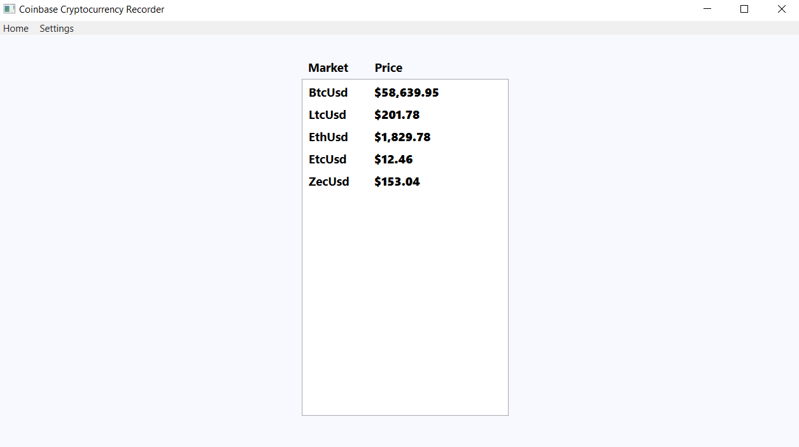
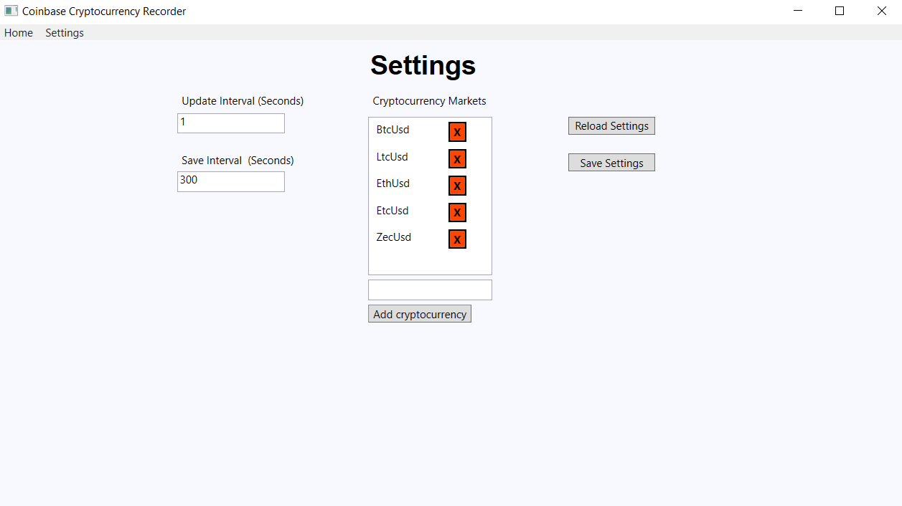
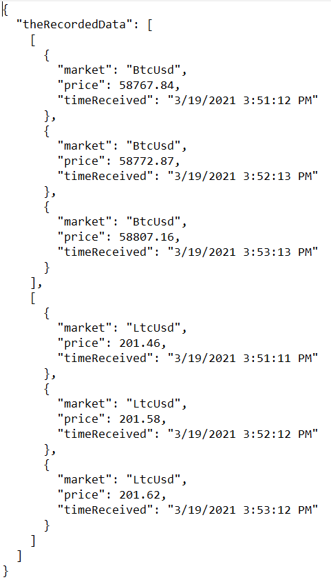

# Coinbase Cryptocurrency Recorder

A program that stores cryptocurrency prices retrieved from the Coinbase websocket feed.

#### Features

:heavy_check_mark: Retrieves information from Coinbase using their websocket feed.  
:heavy_check_mark: Displays the current information about various cryptocurrencies.  
:heavy_check_mark: Records cryptocurreny information in a JSON file.  

#### Demonstration

The home page where markets and prices are displayed.
 
 

 
 
The settings page where various settings can be changed.
 
 

 
 
The following image shows an example of how prices are recorded in the RecordedData.json file. Two currencies were recorded for three minutes with the save interval set to one minute. Notice that the seconds of the time received fluctuate slightly. This is due to the price of a currency remaining stable for a few seconds before it was saved. This program updates the data on each price change, saving the most recent price and time that it changed. In a future update, I plan to include an option that makes the program set the times to the time of recording, if more uniform time recordings are desired.
 
 

#### Used Libraries:
[coinbasepro-csharp](https://github.com/dougdellolio/coinbasepro-csharp) 
[Json.NET](https://github.com/JamesNK/Newtonsoft.Json)
